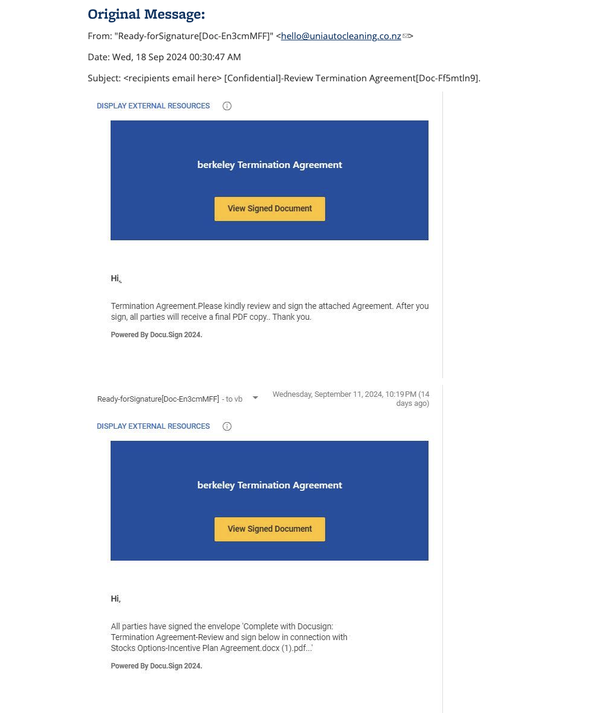

# Incident Report: Phishing Email – Fake DocuSign Termination

## 1. Incident Overview
- **Type:** Phishing / Credential Harvesting
- **Reported By:** End User (Simulated)
- **Date Observed:** 2024-09-18
- **Severity:** High
- **Status:** Confirmed Phishing

---

## 2. Email Metadata Analysis
- **From Name:** Ready-forSignature[Doc-En3cmMFF]
- **From Address:** hello@uniautocleaning.co.nz
- **Spoofed Brand:** DocuSign / UC Berkeley
- **Subject Line:** [Confidential] Review Termination Agreement
- **Sender Domain Mismatch:** Yes (external domain not associated with DocuSign or UC Berkeley)

**Observation:**  
The sender domain does not match the organization being impersonated, indicating email spoofing.

---

## 3. Social Engineering Indicators
- Creates fear and urgency by referencing a termination agreement
- Uses authority and trust by impersonating UC Berkeley
- Mimics legitimate DocuSign branding and workflow
- Encourages immediate user interaction

**Technique:** Psychological manipulation through fear and impersonation

---

## 4. Malicious Call-To-Action (CTA)
- **CTA Button:** "View Signed Document"
- **Intended Outcome:**  
  Likely redirects the user to a fake login page designed to harvest credentials.

**Action Taken:**  
The link was not clicked.

---

## 5. MITRE ATT&CK Mapping
- **Tactic:** Initial Access
- **Technique:** T1566.002 – Phishing: Spearphishing Link

---

## 6. Risk Assessment
- **Potential Impact:** Account compromise, credential theft, follow-on phishing
- **Affected Users:** Faculty or Staff
- **Likelihood:** High (well-crafted impersonation email)

---

## 7. SOC Response Actions
- Email identified as phishing
- User advised not to interact with the message
- Sender domain flagged as malicious
- Security awareness reinforced

---

## 8. Final Verdict
This email is a confirmed phishing attempt leveraging DocuSign impersonation and employment-related fear tactics to steal user credentials.

---

## 9. Evidence

### Original Phishing Email (Source)

## 10. Analyst Verdict

This email is confirmed as **phishing**.

### Indicators Supporting Verdict
- Sender domain does not belong to DocuSign or UC Berkeley
- Uses impersonation of a trusted service (DocuSign)
- Uses urgent employment-related language (termination agreement)
- Encourages immediate interaction via a call-to-action button
- External resources embedded in the message

### Risk Assessment
If interacted with, this email could lead to:
- Credential theft
- Unauthorized account access
- Lateral movement within the organization
- Follow-on business email compromise (BEC)

### Final Classification
**Confirmed Phishing – Credential Harvesting**

